Em desenvolvimento - Backend completo - Web 80% - Mobile inicial

Notei, que acréscimos contam positivamente, então adicionei alguns.

Obs: O nome do app e a imagem, do logo, usados, são fictícios.

<h1>Página de Login(Inicial).<h1>

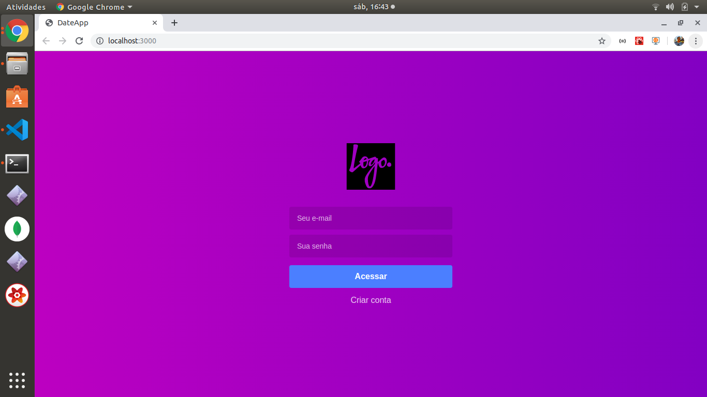

<h1>Teste de Login.<h1>

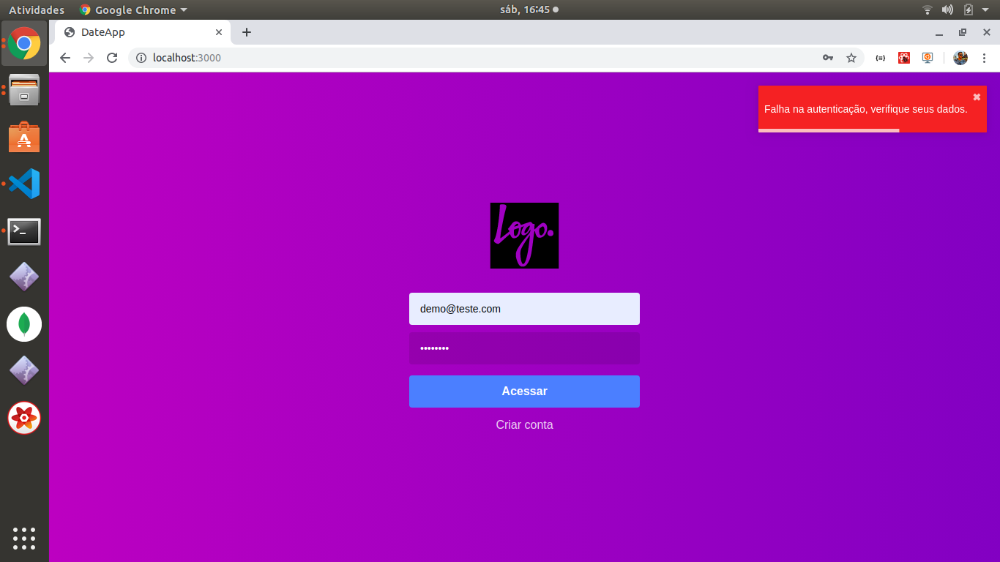

<h1>Página de cadastro.<h1>

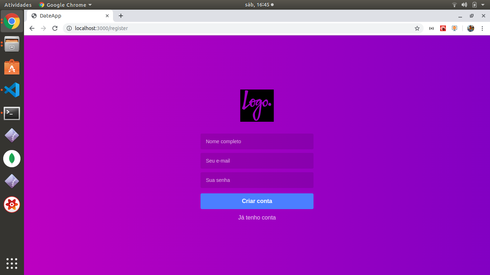

<h1>Testes do cadastro.<h1>

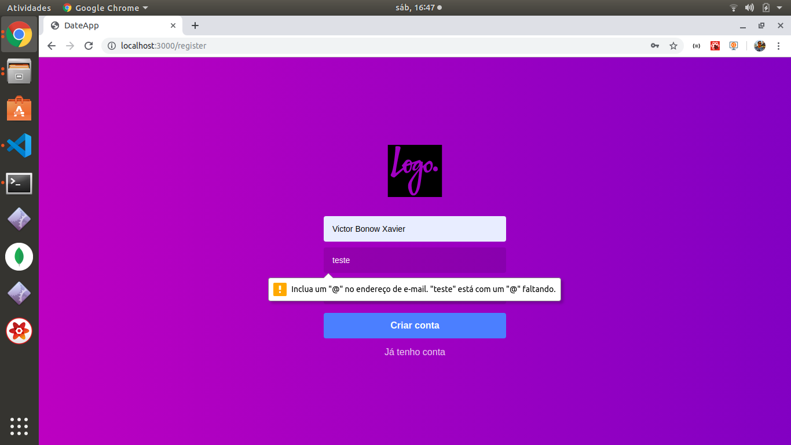

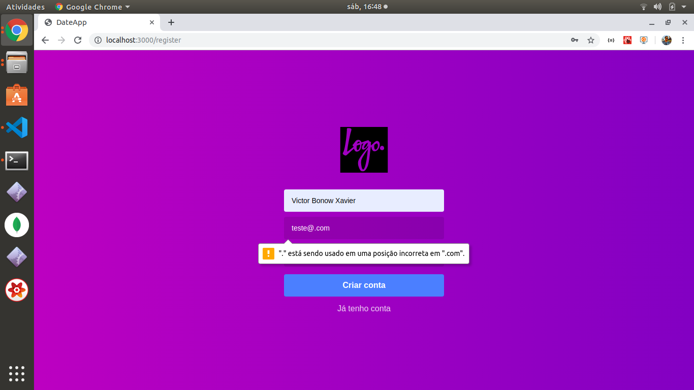

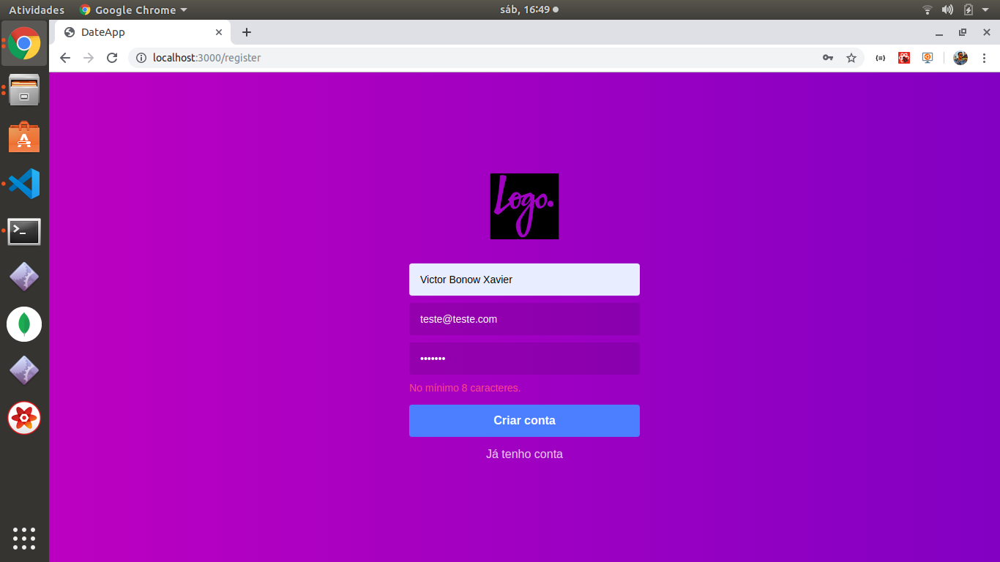

<h1>Página de agendamentos/TODO'S(Em desenvolvimento).<h1>

<h1>Mecânica de notificações.<h1>

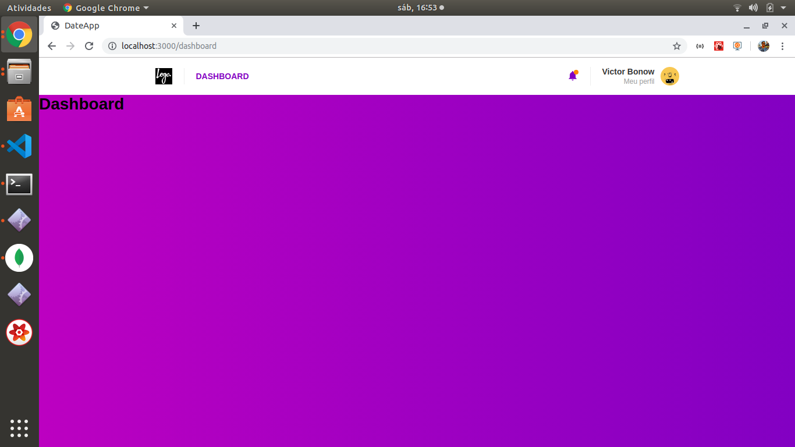

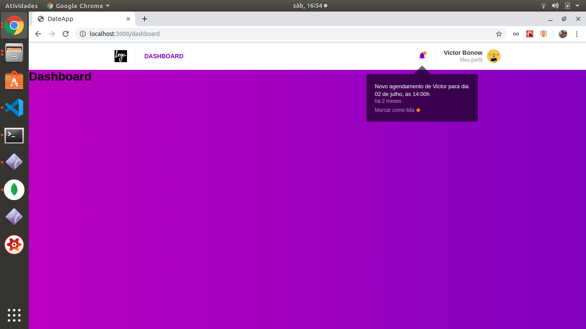

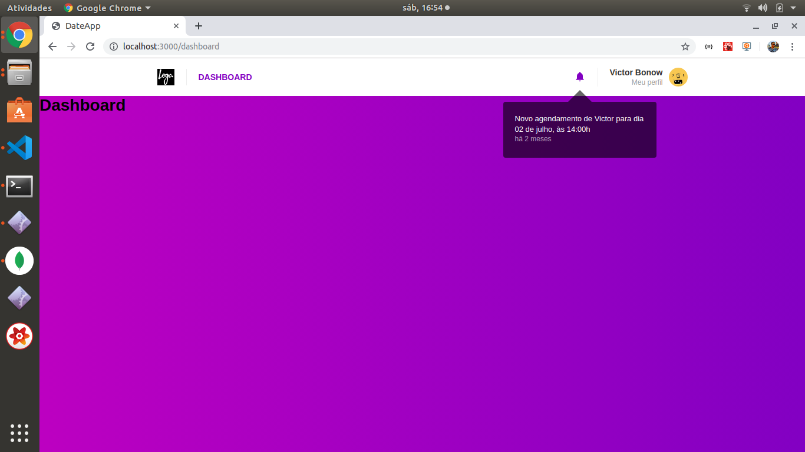

<h1>Página de Profile/Alterações de Usuário(Faltam alguns ajustes).<h1>

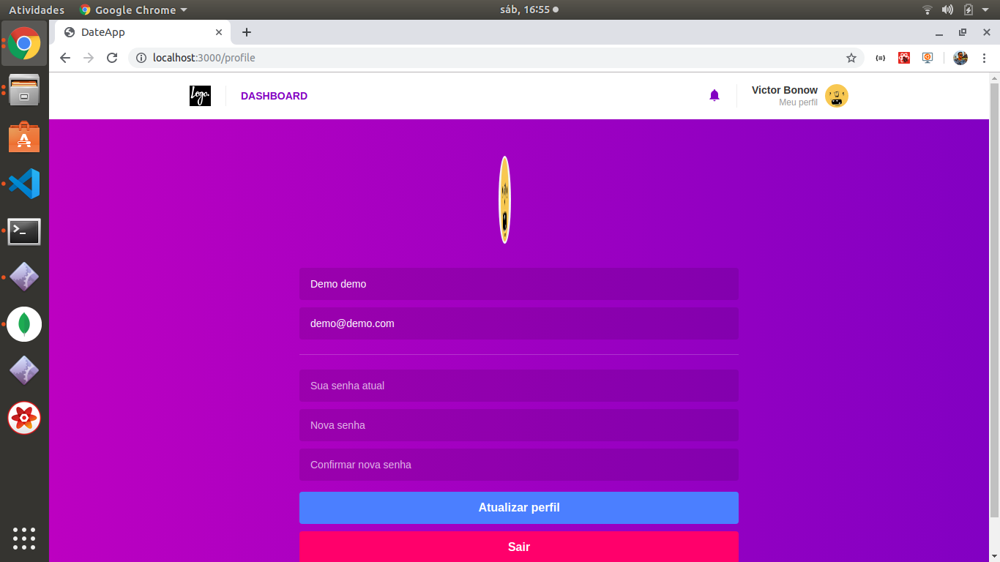

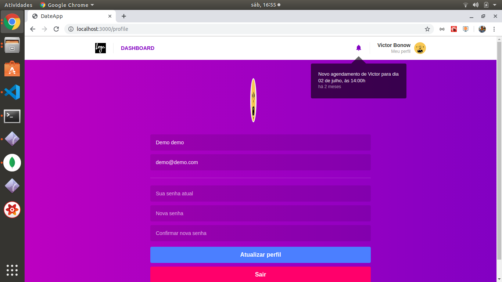
